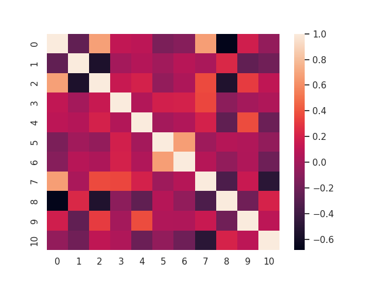

# Data-Mining-HW2
# 可解释回归分析
## 1. 数据分析和预处理
### 1.2 Red Wine Quality
1. **数据类型**

    11个属性均为数值类型，包括浮点型和整型。

2. **归一化**

    每个属性的数值范围差异较⼤。例如， volatile acidity等属性在(0,1)间，⽽
total sulfur dioxide数值可能>100。这会使linear regression、logistic regression等⽅法在随机初始
化的情况下⽆法很好地学到与绝对值较⼩的属性的相关性，且造成参数矩阵的病态性、学习不稳定。因此，我们采⽤Z-score的⽅式对数值进⾏归⼀化。

3. **数据缺失**

    不存在数据缺失的情况。

4. **数据冗余**

    11个属性间的相关系数热力图统计如下：
    
    
    不存在相关系数绝对值⼤于0.75的属性，可以认为数据冗余程度低。
